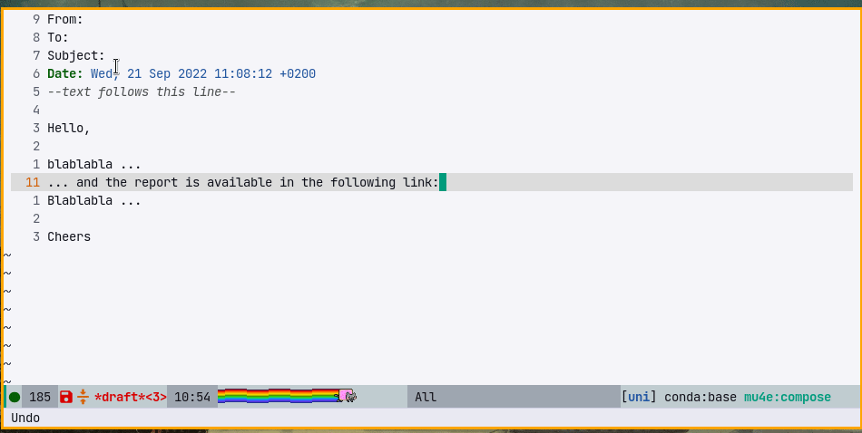

# message-links.el

Emacs library to add reference links in message-mode without html.

<!-- markdown-toc start - Don't edit this section. Run M-x markdown-toc-refresh-toc -->
**Table of Contents**

- [What it does](#what-it-does)
- [How to use](#how-to-use)
- [customization](#customization)

<!-- markdown-toc end -->


## What it does

Consider the following textual message with a long link:

``` text
Hello,

blablabla ...
... and the report is available in the following link: https://my-file-server.org/Y5yu9Z1+3K83NFyPRy0siDw583mc+4iEljFmkUdgIIJuE5OAZTyhV00rXSMu/LP6z/o8HoD8hnXVIg2bwkddXw==
Blablabla ...

Cheers

```

This could be transformed into:

``` text
Hello,

blablabla ...
... and the report is available in the link [1]
Blablabla ...

Cheers

---links---
[1] : https://my-file-server.org/Y5yu9Z1+3K83NFyPRy0siDw583mc+4iEljFmkUdgIIJuE5OAZTyhV00rXSMu/LP6z/o8HoD8hnXVIg2bwkddXw==
```

This mode allow the generation of the references in the text as follow:


## How to use

- Download this repository into `~/.emacs.d`
``` elisp
(load "~/.emacs.d/message-links.el/message-links.el")
(define-key message-mode-map (kbd "C-c l") 'message-links-add)
```

Then press `C-c l` when composing a message to add a link.

## Commands

- `message-links-add-link` enter a new link.
- `message-links-convert-link-at-point` match a link at the cursor location, and convert it to a referenced link (this uses `message-links-match-link-at-point-fn` to identify links).
- `message-links-convert-links-all` convert all links to references in the buffer or active region (using `message-links-match-link-forward-fn` to scan for links).
- `message-links-renumber-all` re-number all links starting from `message-links-index-start`, putting the footnotes in order if necessary. This can be useful when editing paragraphs that contain links which may become un-ordered.

## customization

- `message-links-link-header` : Default = `---links---` : Header use to separate links and the original text. If set to `nil`, disable the header.
- `message-links-index-start` : Default = `1` : Start index of links. So by default the first link will be `[1]`.
- `message-links-sep-footnotes-link` : Default = `'("[" . "] : " ` : The text to use for links in the bottom of the buffer. Default, links look like `[1] : link text`. Customize with `(setq message-links-sep-footnotes-link '("{^" . "}: "))` and links in footnote will look like `{^1}: link text`
- `message-links-sep-text-link` : Default = `'("[" . "]")` : The text to use for links in the text. Default, links look like `blablabla [1] blablabla`. Customize with `(setq message-links-sep-text-link '("{^" . "}"))` and links in text will look like `blablabla {^1} blablabla`
- `message-links-match-link-at-point-fn` : Defaults to using thing-at-pt (url). Return the bounds of the link at the point as a cons cell or nil.
- `message-links-match-link-forward-fn` : Defaults to stepping over white-space for the next `message-links-match-link-at-point-fn`. Takes a single limit argument (representing a buffer position not to seek past), returns the bounds of the next link or nil when none are found.
